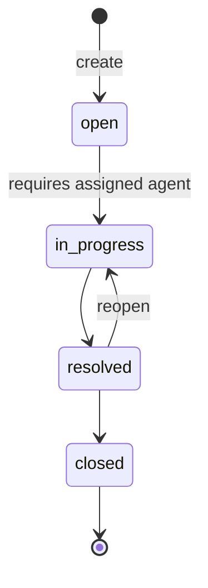

# Data Model: Ticket Management

**Feature**: [spec.md](./spec.md) | **Plan**: [plan.md](./plan.md) | **Date**: 2026-10-07

All tables use Laravel conventions (`id` bigint auto-increment, `created_at`/`updated_at` unless
noted). Enum values are stored as strings and cast to PHP backed enums.

## Enums (single source of truth)

### TicketStatus (`App\Enums\TicketStatus`)

| Value         | Label       | Allowed next          |
|---------------|-------------|-----------------------|
| `open`        | Open        | `in_progress`         |
| `in_progress` | In Progress | `resolved`            |
| `resolved`    | Resolved    | `closed`, `in_progress` (reopen) |
| `closed`      | Closed      | — (read-only)         |

Methods: `label(): string`, `allowedTransitions(): array<self>`, `canTransitionTo(self): bool`,
`isClosed(): bool`.

### TicketPriority (`App\Enums\TicketPriority`)

`low` Low · `medium` Medium · `high` High · `urgent` Urgent. Method: `label()`.

### TicketCategory (`App\Enums\TicketCategory`)

`billing` Billing · `technical` Technical · `account` Account · `general` General.
Method: `label()`.

### TicketHistoryEvent (`App\Enums\TicketHistoryEvent`)

`created` · `assigned` · `status_changed` · `note_added`.

## State machine

Guards applied by `TicketService`, in this order:

1. The ticket is Closed → reject (`closed`).
2. The target is not in `allowedTransitions()` → reject (`invalidTransition`), including when the
   target is the current status.
3. The target is `in_progress` and `agent_id` is null → reject (`agentRequired`).

## Tables

### customers

| Column     | Type          | Rules                                     |
|------------|---------------|-------------------------------------------|
| id         | bigint PK     |                                           |
| name       | string(255)   | required                                  |
| email      | string(255)   | required, unique, stored lower-cased      |
| phone      | string(30)    | nullable                                  |
| timestamps |               |                                           |

Relations: `hasMany(Ticket)`. `$fillable = [name, email, phone]`.

### agents

| Column     | Type        | Rules            |
|------------|-------------|------------------|
| id         | bigint PK   |                  |
| name       | string(255) | required         |
| email      | string(255) | required, unique |
| timestamps |             |                  |

Relations: `hasMany(Ticket)`. `$fillable = [name, email]`. Seeded only; no create/edit endpoints.

### tickets

| Column      | Type                 | Rules                                               |
|-------------|----------------------|-----------------------------------------------------|
| id          | bigint PK            |                                                     |
| number      | string(20), nullable | unique; set to `TCK-%04d` from `id` in the create transaction |
| customer_id | FK → customers       | required, `restrictOnDelete`                        |
| agent_id    | FK → agents, nullable| `nullOnDelete`; **indexed**                         |
| subject     | string(255)          | required                                            |
| description | text, nullable       | max 5,000                                           |
| category    | string(20)           | `TicketCategory`; **indexed**                       |
| priority    | string(20)           | `TicketPriority`; **indexed**                       |
| status      | string(20)           | `TicketStatus`, default `open`; **indexed**         |
| timestamps  |                      |                                                     |

Casts: `category`, `priority`, `status` → enums.
`$fillable = [customer_id, subject, description, category, priority]`. `status`, `agent_id`, and
`number` are set only by `TicketService`, never by mass assignment from request data.
Relations: `belongsTo(Customer)`, `belongsTo(Agent)`, `hasMany(TicketNote)` ordered by `id`,
`hasMany(TicketHistory)` ordered by `id`.

### ticket_notes

| Column     | Type           | Rules                                  |
|------------|----------------|----------------------------------------|
| id         | bigint PK      |                                        |
| ticket_id  | FK → tickets   | `cascadeOnDelete`, indexed             |
| body       | text           | required, 1–2,000 chars, not blank     |
| timestamps |                |                                        |

`$fillable = [body]`. Created only through `TicketService::addNote()`.

### ticket_histories

| Column      | Type                  | Rules                                       |
|-------------|-----------------------|---------------------------------------------|
| id          | bigint PK             |                                             |
| ticket_id   | FK → tickets          | `cascadeOnDelete`, indexed                  |
| event       | string(20)            | `TicketHistoryEvent`                        |
| description | string(255)           | human-readable, e.g., "Status changed from Open to In Progress" |
| old_value   | string(255), nullable | previous status value or agent name         |
| new_value   | string(255), nullable | new status value or agent name              |
| created_at  | timestamp             | no `updated_at` (append-only)               |

`const UPDATED_AT = null`. `$fillable = [event, description, old_value, new_value]`. There is no
update or delete code path (FR-022).

## History descriptions

| Event          | Description template                                             |
|----------------|------------------------------------------------------------------|
| created        | `Ticket TCK-0001 created`                                        |
| assigned       | `Assigned to {agent}` / `Reassigned from {old} to {new}`         |
| status_changed | `Status changed from {Old} to {New}`; reopen: `Ticket reopened (Resolved → In Progress)` |
| note_added     | `Note added`                                                     |

## Validation summary (Form Requests)

| Request                 | Rules |
|-------------------------|-------|
| `StoreTicketRequest`    | `customer_name` required string max:255; `customer_email` required email max:255 (lower-cased, trimmed); `customer_phone` nullable string max:30; `subject` required string max:255; `description` nullable string max:5000; `category` required `Rule::enum(TicketCategory)`; `priority` required `Rule::enum(TicketPriority)` |
| `ListTicketsRequest`    | `status`/`priority`/`category` nullable `Rule::enum`; `agent_id` nullable, `none` or `exists:agents,id`; `search` nullable string max:100; `page` nullable integer min:1 |
| `AssignTicketRequest`   | `agent_id` required integer `exists:agents,id` |
| `ChangeStatusRequest`   | `status` required `Rule::enum(TicketStatus)` |
| `StoreNoteRequest`      | `body` required string max:2000 (whitespace-only becomes null through middleware → required fails) |
