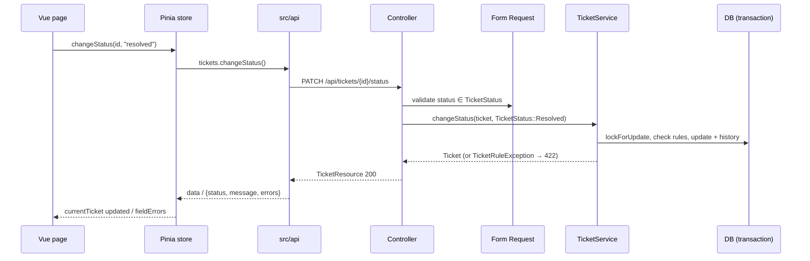

# Implementation Plan: Ticket Management

**Branch**: `001-ticket-management` | **Date**: 2026-10-07 | **Spec**: [spec.md](./spec.md)

**Input**: Feature specification from `/specs/001-ticket-management/spec.md`

## Summary

Build the Ticket Management module end to end. The supervisor can create tickets (reusing
customers by email), list, filter, and search them (15 per page), view full details, assign
agents, move tickets through a fixed status flow, and add internal notes. Every change writes an
append-only history entry in the same transaction.

The backend is a Laravel JSON REST API:

- Controllers stay thin.
- Form Requests handle validation.
- A `TicketService` owns all business rules.
- Backed enums are the source of truth, and `TicketStatus` owns the transitions.
- API Resources shape every response.
- A single `TicketRuleException` renders rule failures as 422 field errors.

The frontend is a Vue 3 single-page app:

- All HTTP goes through `src/api/`.
- One Pinia store holds ticket state.
- Every view handles loading, empty, error, and 404 states.

## Technical Context

**Language/Version**: PHP 8.2+ (8.2.26 installed); JavaScript (ES2022, no TypeScript)

**Primary Dependencies**:

- Backend: Laravel 12.x, already scaffolded. It has the same structure as 11; see research R1.
- Frontend: Vue 3.5, Vue Router 5, Pinia 4, Axios 1, and Vite 8, all already installed.

**Storage**: MySQL 8 (WAMP) in development; SQLite `:memory:` in tests

**Testing**: PHPUnit 11 (feature + unit); Vitest 4 with @vue/test-utils and jsdom

**Target Platform**: Local Windows (WAMP). The API runs under `php artisan serve` (:8000) and the
SPA under the Vite dev server (:5173).

**Project Type**: Web application (separate `backend/` API and `frontend/` SPA)

**Performance Goals**: The list and detail views load within 2 s with up to 10,000 tickets (SC-007),
using indexed filters, eager loading, and paginating 15 at a time.

**Constraints**:

- No auth.
- No new Composer or npm packages.
- CORS is limited to the Vite origin.
- All user text is rendered as plain text.

**Scale/Scope**: 1 supervisor, 5 agents, about 10,000 tickets at most; 4 pages and 8 endpoints

## Constitution Check

*GATE: Must pass before Phase 0 research. Re-check after Phase 1 design.*

| # | Principle | How this plan complies | Status |
|---|-----------|------------------------|--------|
| I | Scope Discipline | Only the six features in the spec. There are no auth, SLA, channel, report, or agent CRUD endpoints, and the default `/user` sanctum route is removed (R11). | ✅ |
| II | Separation of Concerns | Controllers only resolve the request, call `TicketService`, and return a Resource. Rules live in Form Requests and `TicketService`. `TicketStatus`, `TicketPriority`, and `TicketCategory` are the only source of values; validation uses `Rule::enum`, and `/meta` is built from the enums. | ✅ |
| III | API Consistency | JSON REST. POST returns 201. Validation and `TicketRuleException` return 422 `{message, errors}`. 404 is JSON for `api/*` (R5). All bodies go through `TicketResource`, `NoteResource`, `AgentResource`, `CustomerResource`, `HistoryResource`, and `MetaResource`. | ✅ |
| IV | Test Coverage | Feature tests map 1:1 to the acceptance scenarios (tasks will cite scenario IDs). `TicketStatusTest` unit-tests every from→to pair. phpunit.xml already uses SQLite `:memory:`. | ✅ |
| V | Data Integrity | Every service mutation runs in `DB::transaction()` with `lockForUpdate()` and writes the change plus its history entry together (R6). | ✅ |
| VI | Security | Form Requests on every input, including list filters. `$fillable` on every model, and `status`/`agent_id`/`number` are not fillable from requests. Search uses bound, escaped LIKE (R8). Vue uses `{{ }}` only, never `v-html`. `.env` is gitignored and `.env.example` is updated. | ✅ |
| VII | Frontend Architecture | Vue 3 Composition API + Pinia + Vue Router. HTTP only via `src/api/`. Loading, empty, error, and 404 components are used on every page. | ✅ |
| VIII | Simplicity | No new packages. One exception class. Ticket numbers come from the id (R2). No repositories or DTO layers. | ✅ |
| IX | Git Discipline | `tasks.md` will be sized one task per commit, with Conventional Commit prefixes. | ✅ |
| X | Accountable AI Usage | `docs/ai-usage.md` is created in the setup phase. Each task's commit updates it. | ✅ |

**Gate result (pre-research)**: PASS. **Gate result (post-design)**: PASS. There are no
violations, so Complexity Tracking is empty.

## Project Structure

### Documentation (this feature)

```text
specs/001-ticket-management/
├── plan.md              # This file
├── research.md          # Phase 0: decisions R1–R14
├── data-model.md        # Phase 1: enums, state machine, tables, validation
├── quickstart.md        # Phase 1: setup, tests, manual E2E checks
├── contracts/
│   └── api.md           # Phase 1: REST contract for all 8 endpoints
├── checklists/
│   └── requirements.md  # Spec quality checklist
└── tasks.md             # Phase 2 (/speckit-tasks; not created here)
```

### Source Code (repository root)

```text
backend/
├── app/
│   ├── Enums/
│   │   ├── TicketStatus.php           # values, labels, allowedTransitions(), canTransitionTo()
│   │   ├── TicketPriority.php
│   │   ├── TicketCategory.php
│   │   └── TicketHistoryEvent.php
│   ├── Exceptions/
│   │   └── TicketRuleException.php    # 422 {message, errors:{field:[...]}}
│   ├── Http/
│   │   ├── Controllers/Api/
│   │   │   ├── TicketController.php        # index, store, show
│   │   │   ├── TicketAssignmentController.php
│   │   │   ├── TicketStatusController.php
│   │   │   ├── TicketNoteController.php
│   │   │   ├── AgentController.php
│   │   │   └── MetaController.php
│   │   ├── Requests/
│   │   │   ├── ListTicketsRequest.php
│   │   │   ├── StoreTicketRequest.php
│   │   │   ├── AssignTicketRequest.php
│   │   │   ├── ChangeStatusRequest.php
│   │   │   └── StoreNoteRequest.php
│   │   └── Resources/
│   │       ├── TicketResource.php
│   │       ├── CustomerResource.php
│   │       ├── AgentResource.php
│   │       ├── NoteResource.php
│   │       ├── HistoryResource.php
│   │       └── MetaResource.php           # enums → statuses/priorities/categories/transitions
│   ├── Models/
│   │   ├── Customer.php
│   │   ├── Agent.php
│   │   ├── Ticket.php
│   │   ├── TicketNote.php
│   │   └── TicketHistory.php
│   └── Services/
│       └── TicketService.php          # create, list query, assign, changeStatus, addNote
├── bootstrap/app.php                  # JSON rendering for api/*, 404 message
├── config/cors.php                    # published; FRONTEND_URL origin
├── database/
│   ├── factories/                     # Customer, Agent, Ticket factories
│   ├── migrations/                    # customers, agents, tickets, ticket_notes, ticket_histories
│   └── seeders/                       # AgentSeeder(5), CustomerSeeder(10), TicketSeeder(30 via service)
├── routes/api.php                     # 8 routes; /user route removed
└── tests/
    ├── Unit/
    │   ├── TicketStatusTest.php       # every from→to pair
    │   └── TicketEnumsTest.php        # priority, category, history event
    └── Feature/
        ├── ApiErrorHandlingTest.php   # JSON 404 for api/*
        ├── TicketRuleExceptionTest.php
        ├── TicketServiceTest.php      # service rules, history, rollback
        ├── TicketHistoryTest.php      # history is append-only
        ├── CreateTicketTest.php       # US1
        ├── ListTicketsTest.php        # US2
        ├── ShowTicketTest.php         # US3
        ├── AssignTicketTest.php       # US4
        ├── ChangeTicketStatusTest.php # US5
        ├── AddTicketNoteTest.php      # US6
        ├── MetaAndAgentsTest.php
        └── DatabaseSeederTest.php

frontend/
├── src/
│   ├── api/
│   │   ├── http.js                    # axios instance + error normalizer
│   │   ├── tickets.js                 # list, get, create, assign, changeStatus, addNote
│   │   └── meta.js                    # getMeta, getAgents
│   ├── stores/
│   │   └── tickets.js                 # the single Pinia store (replaces counter.js)
│   ├── router/index.js                # /tickets, /tickets/new, /tickets/:id, catch-all
│   ├── pages/
│   │   ├── TicketList.vue
│   │   ├── TicketCreate.vue
│   │   ├── TicketDetail.vue
│   │   └── NotFound.vue
│   ├── components/
│   │   ├── TicketFilters.vue
│   │   ├── PaginationBar.vue
│   │   ├── StatusBadge.vue
│   │   ├── StatusActions.vue          # buttons from allowed_transitions only
│   │   ├── AssignAgentForm.vue
│   │   ├── NoteForm.vue
│   │   ├── HistoryList.vue
│   │   ├── FieldError.vue
│   │   └── StateMessage.vue           # loading / empty / error (with retry)
│   ├── utils/format.js                # date formatting (Intl)
│   ├── assets/main.css                # plain CSS
│   ├── App.vue
│   └── main.js
└── src/__tests__/
    ├── api/http.spec.js
    ├── stores/tickets.spec.js
    ├── components/{shared,TicketFilters,AssignAgentForm,StatusActions,NoteForm}.spec.js
    └── pages/{TicketList,TicketCreate,TicketDetail}.spec.js

docs/
└── ai-usage.md                        # Constitution X log
```

**Structure Decision**: This is a web application with the existing `backend/` (Laravel) and
`frontend/` (Vite + Vue) scaffolds. Backend code follows Laravel 12 conventions, with an added
`app/Enums` and `app/Services`. Frontend pages live in `src/pages/` as requested, and the scaffold
`stores/counter.js` and `__tests__/App.spec.js` are replaced.

## Request flow



## Complexity Tracking

No constitution violations; nothing to justify.
