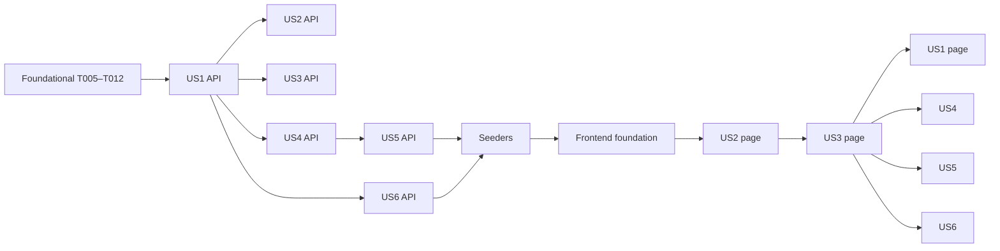

---

description: "Task list for the Ticket Management module"
---

# Tasks: Ticket Management

**Input**: Design documents from `/specs/001-ticket-management/`

**Prerequisites**: [plan.md](./plan.md), [spec.md](./spec.md), [research.md](./research.md),
[data-model.md](./data-model.md), [contracts/api.md](./contracts/api.md),
[quickstart.md](./quickstart.md)

**Tests**: Tests are required. Constitution IV says every acceptance scenario needs at least one
PHPUnit feature test, and status transitions need unit tests. Each backend task ships its tests
**in the same commit** as the code. Test methods reference scenario IDs as `US<n>-AS<m>`, where
`m` is the acceptance scenario number in spec.md. Edge cases are referenced as `EC`.

**Organization**: The order you requested is setup → enums and database → backend endpoints with
feature tests (one sub-section per user story) → seed data → frontend foundation → frontend pages
(one sub-section per user story) → final checks and README. Story labels let each user story be
traced across the backend and frontend phases.

## Format: `[ID] [P?] [Story] Description`

- **[P]**: Can run in parallel (different files, no dependency on an incomplete task)
- **[Story]**: The user story the task serves (US1–US6 from spec.md)
- **Commit**: The exact Conventional Commit message for the task. **One task = one commit.**
- **Every commit** also appends an entry to `docs/ai-usage.md` (Constitution X), and the backend
  suite (`php artisan test`) and/or frontend suite (`npm run test:unit -- --run`) MUST pass before
  committing.

## Path Conventions

- Backend (Laravel 12): `backend/app/`, `backend/database/`, `backend/routes/`, `backend/tests/`
- Frontend (Vue 3 + Vite): `frontend/src/`, tests in `frontend/src/__tests__/`

---

## Phase 1: Setup (Shared Infrastructure)

**Purpose**: Project configuration, the AI usage log, and API plumbing that every story relies on.

- [ ] T001 Create `docs/ai-usage.md` with a short purpose paragraph and a log table with columns
  `Date | Task | Tool | What was generated | What changed in review | How it was verified`, plus a
  first row for the spec, plan, and tasks documents
  - Commit: `docs: add AI usage log`
- [ ] T002 Configure backend environment defaults in `backend/.env.example`:
  `DB_CONNECTION=mysql`, `DB_HOST=127.0.0.1`, `DB_PORT=3306`, `DB_DATABASE=support_crm`,
  `DB_USERNAME=root`, `DB_PASSWORD=`, `FRONTEND_URL=http://localhost:5173`. Confirm `.env` is listed
  in `backend/.gitignore` and not tracked (`git ls-files backend/.env` prints nothing). Replace the
  `/user` `auth:sanctum` route in `backend/routes/api.php` with an empty route file (keep the
  `use` lines only).
  - Commit: `chore(backend): configure MySQL env example and drop default auth route`
- [ ] T003 [P] Publish the CORS config with `php artisan config:publish cors` to
  `backend/config/cors.php`. Set `'paths' => ['api/*']`,
  `'allowed_origins' => [env('FRONTEND_URL', 'http://localhost:5173')]`, `'allowed_methods' => ['*']`,
  `'allowed_headers' => ['*']`, and `'supports_credentials' => false`
  - Commit: `chore(backend): restrict CORS to the Vite dev server`
- [ ] T004 Make every `api/*` error render as JSON in `backend/bootstrap/app.php`:
  - Call `$exceptions->shouldRenderJsonWhen(fn ($request) => $request->is('api/*') || $request->expectsJson())`.
  - Add a `render` callback for `NotFoundHttpException` on `api/*`. When `$e->getPrevious()` is a
    `ModelNotFoundException`, return `{"message": "<Model basename> not found."}` (for example
    "Ticket not found."); otherwise return `{"message": "Resource not found."}`. Both are 404.
  - Add `backend/tests/Feature/ApiErrorHandlingTest.php`, asserting that `GET /api/does-not-exist`
    with no `Accept` header returns 404 JSON `{"message": "Resource not found."}`.
  - Commit: `feat(backend): render API errors as JSON`

---

## Phase 2: Foundational — Enums & Database (Blocking Prerequisites)

**Purpose**: The enums (single source of truth), schema, models, the shared rule exception, API
resources, and the reference-data endpoints.

**⚠️ CRITICAL**: No user story work can begin until this phase is complete.

- [ ] T005 [P] Create `backend/app/Enums/TicketStatus.php`, a string-backed enum:
  - Cases `Open='open'`, `InProgress='in_progress'`, `Resolved='resolved'`, `Closed='closed'`.
  - Methods: `label(): string` (Open, In Progress, Resolved, Closed);
    `allowedTransitions(): array` (open→[in_progress], in_progress→[resolved],
    resolved→[closed, in_progress], closed→[]); `canTransitionTo(self $to): bool`;
    `isClosed(): bool`; `actionLabel(self $to): string` ("Reopen" for resolved → in_progress,
    otherwise `$to->label()`); and a static `options(): array` returning `[{value, label}]`.
  - Add the unit test `backend/tests/Unit/TicketStatusTest.php` (extends `PHPUnit\Framework\TestCase`).
    It uses a data provider over **all 16 from→to pairs** and asserts exactly the 4 allowed moves
    return true, including that same-status moves are false. It also covers labels, `isClosed()`,
    `actionLabel()` for all 4 allowed moves,
    and `options()`.
  - Commit: `feat(backend): add TicketStatus enum with transition rules`
- [ ] T006 [P] Create the string-backed enums below, each with `label()` and a static `options()`.
  Add `backend/tests/Unit/TicketEnumsTest.php` asserting their values, labels, and option lists.
  - `backend/app/Enums/TicketPriority.php` (`low` Low, `medium` Medium, `high` High, `urgent` Urgent)
  - `backend/app/Enums/TicketCategory.php` (`billing` Billing, `technical` Technical, `account`
    Account, `general` General)
  - `backend/app/Enums/TicketHistoryEvent.php` (`created`, `assigned`, `status_changed`, `note_added`)
  - Commit: `feat(backend): add priority, category and history event enums`
- [ ] T007 Create the customers and agents tables, models, and factories:
  - Migrations in `backend/database/migrations/`:
    - **customers**: `name` string(255) required; `email` string(255) "required, unique, stored
      lower-cased"; `phone` string(30) "nullable"; timestamps.
    - **agents**: `name` string(255) required; `email` string(255) "required, unique"; timestamps.
  - Models:
    - `backend/app/Models/Customer.php` with `$fillable = ['name','email','phone']` and `hasMany(Ticket)`.
    - `backend/app/Models/Agent.php` with `$fillable = ['name','email']` and `hasMany(Ticket)`.
  - Factories: `backend/database/factories/CustomerFactory.php` (lower-case unique safe emails) and
    `backend/database/factories/AgentFactory.php`.
  - Commit: `feat(db): add customers and agents tables`
- [ ] T008 Create the tickets migration in `backend/database/migrations/`. Columns:
  - `number` string(20) "nullable", **unique**
  - `customer_id` FK → customers, `restrictOnDelete`
  - `agent_id` FK → agents, "nullable", `nullOnDelete`, **indexed**
  - `subject` string(255) required
  - `description` text "nullable"
  - `category` string(20) **indexed**
  - `priority` string(20) **indexed**
  - `status` string(20), default `'open'`, **indexed**
  - timestamps

  Also create the model and factory:
  - `backend/app/Models/Ticket.php` with
    `$fillable = ['customer_id','subject','description','category','priority']` (status, agent_id,
    and number are NOT fillable). Casts: `status` → TicketStatus, `priority` → TicketPriority,
    `category` → TicketCategory. Relations: `customer()`, `agent()`, `notes()` ordered by id, and
    `histories()` ordered by id. A static `formatNumber(int $id): string` returns
    `'TCK-' . str_pad((string) $id, 4, '0', STR_PAD_LEFT)`; it is the only place the format is
    defined.
  - `backend/database/factories/TicketFactory.php`, which sets `number` in an `afterCreating` hook
    with `Ticket::formatNumber($ticket->id)`.
  - Commit: `feat(db): add tickets table and model`
- [ ] T009 Create the ticket_notes and ticket_histories migrations in `backend/database/migrations/`:
  - **ticket_notes**: `ticket_id` FK `cascadeOnDelete` indexed; `body` text; timestamps.
  - **ticket_histories**: `ticket_id` FK `cascadeOnDelete` indexed; `event` string(20);
    `description` string(255); `old_value` string(255) nullable; `new_value` string(255) nullable;
    `created_at` timestamp only, with no `updated_at`.

  Models:
  - `backend/app/Models/TicketNote.php` with `$fillable = ['body']`.
  - `backend/app/Models/TicketHistory.php` with `const UPDATED_AT = null`,
    `$fillable = ['event','description','old_value','new_value']`, `event` cast to
    TicketHistoryEvent, and a `booted()` method whose `updating` and `deleting` listeners throw
    `LogicException('Ticket history is append-only.')`.

  Both use `belongsTo(Ticket)`.

  Add `backend/tests/Feature/TicketHistoryTest.php`, asserting that updating or deleting a
  history row throws, and that deleting its ticket removes the history rows (FR-022).
  - Commit: `feat(db): add ticket notes and history tables`
- [ ] T010 Create `backend/app/Exceptions/TicketRuleException.php`, which extends `RuntimeException`.
  - It has a `field` property and named constructors:
    - `invalidTransition(TicketStatus $from, TicketStatus $to)` → field `status`, message
      "Cannot change status from {From} to {To}."
    - `agentRequired()` → field `status`, message "Assign an agent before moving the ticket to In Progress."
    - `closed(string $field)` → message "Closed tickets cannot be changed."
    - `alreadyAssigned(Agent $agent)` → field `agent_id`, message "Ticket is already assigned to {name}."
  - `render()` returns 422 `{"message": msg, "errors": {field: [msg]}}`.
  - Add `backend/tests/Feature/TicketRuleExceptionTest.php`, asserting the rendered status and
    JSON shape for each constructor.
  - Commit: `feat(backend): add TicketRuleException rendered as 422`
- [ ] T011 Create the API resources in `backend/app/Http/Resources/`, following the shapes in
  `contracts/api.md`:
  - `CustomerResource` (id, name, email, phone)
  - `AgentResource` (id, name, email)
  - `NoteResource` (id, body, created_at ISO 8601)
  - `HistoryResource` (id, event, description, old_value, new_value, created_at)
  - `TicketResource`:
    - Fields: id, number, subject, description.
    - `status`, `priority`, and `category` as `{value, label}`.
    - `is_closed` as a boolean from `$this->status->isClosed()`.
    - `allowed_transitions` as `[{value, label, action_label}]`, where `action_label` comes from
      `TicketStatus::actionLabel()`.
    - `customer` and `agent` via `whenLoaded`; `agent` is null when unassigned.
    - `notes` as `NoteResource::collection($this->whenLoaded('notes'))` and `history` as
      `HistoryResource::collection($this->whenLoaded('histories'))` (the relation is `histories`,
      the API key is `history`).
    - created_at and updated_at.
  - Commit: `feat(backend): add API resources`
- [ ] T012 Create the reference-data endpoints and tests:
  - `backend/app/Http/Resources/MetaResource.php`. It builds `statuses`, `priorities`, and
    `categories` from the enums' `options()`, plus `transitions` as a map of value → [values]
    from `TicketStatus::allowedTransitions()`.
  - `backend/app/Http/Controllers/Api/MetaController.php` (invokable). It returns
    `new MetaResource(null)`, so the response is wrapped in `data` like every other endpoint.
  - `backend/app/Http/Controllers/Api/AgentController.php` (`index`). It returns
    `AgentResource::collection` sorted by name.
  - Register `GET /api/meta` and `GET /api/agents` in `backend/routes/api.php`.
  - Add `backend/tests/Feature/MetaAndAgentsTest.php`.
  - Commit: `feat(api): add meta and agents endpoints`

**Checkpoint**: Schema migrates on SQLite and MySQL, enums are unit-tested, and `/api/meta` and
`/api/agents` respond.

---

## Phase 3: Backend API by User Story

Each story's endpoint ships with its feature tests. Mutations follow research R6: run inside
`DB::transaction`, re-read the ticket with `lockForUpdate()`, check the rules, write the change,
and write its history entry.

### User Story 1 — Log a customer request as a ticket (P1) 🎯 MVP

**Goal**: `POST /api/tickets` creates an Open, unassigned ticket with a TCK number and a
"created" history entry, reusing customers by email.
**Independent Test**: `php artisan test --filter=CreateTicket` passes. A curl POST returns 201
with `number=TCK-0001`.

- [ ] T013 [US1] Create `backend/app/Services/TicketService.php`:
  - Add a private `recordHistory(Ticket $t, TicketHistoryEvent $e, string $description, ?string $old = null, ?string $new = null)`.
  - Add `createTicket(array $data): Ticket`. Inside `DB::transaction`, it:
    - finds or creates the customer with `Customer::firstOrCreate(['email' => $data['customer_email']], ['name' => ..., 'phone' => ...])`, which never overwrites an existing customer;
    - creates the ticket with status `open` and no agent;
    - sets `number = Ticket::formatNumber($ticket->id)`;
    - records `created` with description "Ticket {number} created".
  - Add `backend/tests/Feature/TicketServiceTest.php` with create cases:
    - the number format and its sequence (US1-AS5)
    - TCK-10000 for id 10000 (EC)
    - customer reuse without changing the stored name or phone (US1-AS2, EC)
    - a single "created" history entry
  - Commit: `feat(backend): add TicketService ticket creation`
- [ ] T014 [US1] Create `backend/app/Http/Requests/StoreTicketRequest.php`:
  - `prepareForValidation` lower-cases and trims `customer_email`.
  - Rules:
    - `customer_name` "required string max:255"
    - `customer_email` "required email max:255"
    - `customer_phone` "nullable string max:30"
    - `subject` "required string max:255"
    - `description` "nullable string max:5000"
    - `category` "required `Rule::enum(TicketCategory::class)`"
    - `priority` "required `Rule::enum(TicketPriority::class)`"

  Then create `backend/app/Http/Controllers/Api/TicketController.php@store`, which calls the service,
  loads customer, agent, notes, and histories, and returns `TicketResource` with **201**. Register
  `POST /api/tickets`. Add `backend/tests/Feature/CreateTicketTest.php` covering:
  - US1-AS1 (201, open, agent null, 1 history)
  - US1-AS2 (upper-case email reuses the customer; customer count unchanged)
  - US1-AS3 (a data provider for each missing or invalid required field → 422 with
    `errors.<field>`)
  - US1-AS4 (a bad category or priority → 422)
  - US1-AS5 (sequential number)
  - Commit: `feat(api): create tickets via POST /api/tickets`

### User Story 2 — Find tickets in a list (P1)

**Goal**: `GET /api/tickets` returns paginated, filterable, searchable results.
**Independent Test**: `php artisan test --filter=ListTickets` passes.

- [ ] T015 [US2] Create `backend/app/Http/Requests/ListTicketsRequest.php` with these rules:
  - `status`, `priority`, `category`: "nullable `Rule::enum`"
  - `agent_id`: "nullable, `none` or `exists:agents,id`"
  - `search`: "nullable string max:100"
  - `page`: "nullable integer min:1"

  Add `TicketService::listTickets(array $filters): LengthAwarePaginator`:
  - Apply AND-combined `when()` filters; `agent_id=none` becomes `whereNull('agent_id')`.
  - Search runs on `subject LIKE ? OR number LIKE ?` with `%`, `_`, and `\` escaped and bound
    inside a grouped `where`.
  - Eager-load `customer` and `agent`, sort with `orderByDesc('id')`, and call `paginate(15)`.

  Add `TicketController@index`, which returns `TicketResource::collection`. Register
  `GET /api/tickets`. Add `backend/tests/Feature/ListTicketsTest.php` covering:
  - US2-AS1 (20 tickets → 15 + 5, newest first)
  - US2-AS2, US2-AS3 (each filter, including `agent_id=none`)
  - US2-AS4 (combined filters)
  - US2-AS5 (case-insensitive subject search)
  - US2-AS6 (`TCK-0012` and `0012`)
  - US2-AS7 (empty `data`)
  - EC: `status=pending` → 422; search `%` and `_` treated literally; page past last → empty
    `data` with 200; list items have no `notes` or `history` keys
  - Commit: `feat(api): list, filter and search tickets`

### User Story 3 — View full ticket details (P1)

**Goal**: `GET /api/tickets/{ticket}` returns one ticket with customer, agent, notes, and history.
**Independent Test**: `php artisan test --filter=ShowTicket` passes.

- [ ] T016 [US3] Add `TicketController@show` in `backend/app/Http/Controllers/Api/TicketController.php`
  (route model binding; loads customer, agent, notes, and histories) and register
  `GET /api/tickets/{ticket}`. Add `backend/tests/Feature/ShowTicketTest.php` covering:
  - US3-AS1 (agent, 2 notes, and 4 history entries, oldest first, with timestamps)
  - US3-AS2 (`agent` null, `notes` [])
  - US3-AS3 (`/api/tickets/999999` → 404 `{"message":"Ticket not found."}`)
  - EC: subject or description containing `<script>` is returned unchanged as a string
  - Commit: `feat(api): show ticket details`

### User Story 4 — Assign or reassign an owner (P2)

**Goal**: `PATCH /api/tickets/{ticket}/assign` sets the owner and records history.
**Independent Test**: `php artisan test --filter=AssignTicket` passes.

- [ ] T017 [US4] Add `TicketService::assign(Ticket $ticket, Agent $agent): Ticket` in
  `backend/app/Services/TicketService.php`. Inside a transaction, after `lockForUpdate()`:
  - If closed, throw `TicketRuleException::closed('agent_id')`.
  - If it is the same agent, throw `alreadyAssigned`.
  - Otherwise set `agent_id`, then record `assigned` with "Assigned to {new}" or
    "Reassigned from {old} to {new}" (old_value and new_value are the agent names).

  Extend `backend/tests/Feature/TicketServiceTest.php` with assign cases, including a rollback
  test (FR-023): with a `TicketHistory::creating` listener that throws, `agent_id` is unchanged
  after the exception.
  - Commit: `feat(backend): add ticket assignment to TicketService`
- [ ] T018 [US4] Create:
  - `backend/app/Http/Requests/AssignTicketRequest.php` (`agent_id` "required integer `exists:agents,id`")
  - `backend/app/Http/Controllers/Api/TicketAssignmentController.php` (invokable; returns a
    `TicketResource` with relations, 200)

  Register `PATCH /api/tickets/{ticket}/assign`. Add `backend/tests/Feature/AssignTicketTest.php`
  covering:
  - US4-AS1 (assign + "Assigned to Omar")
  - US4-AS2 (reassign + "Reassigned from Omar to Lina")
  - US4-AS3 (same agent → 422 `errors.agent_id`, history count unchanged)
  - US4-AS4 (unknown agent → 422)
  - US4-AS5 (closed → 422 "Closed tickets cannot be changed.")
  - 404 for a missing ticket
  - Commit: `feat(api): assign and reassign tickets`

### User Story 5 — Move a ticket through its status flow (P2)

**Goal**: `PATCH /api/tickets/{ticket}/status` enforces the fixed flow atomically.
**Independent Test**: `php artisan test --filter=ChangeTicketStatus` passes.

- [ ] T019 [US5] Add `TicketService::changeStatus(Ticket $ticket, TicketStatus $to): Ticket` in
  `backend/app/Services/TicketService.php`. Inside a transaction, after `lockForUpdate()`, apply
  the guards in this order:
  1. If closed, throw `closed('status')`.
  2. If `!canTransitionTo`, throw `invalidTransition`.
  3. If the target is in_progress and `agent_id` is null, throw `agentRequired`.

  Then update the status and record `status_changed`. The description is "Status changed from {Old}
  to {New}", or "Ticket reopened (Resolved → In Progress)" for a reopen; old_value and new_value
  are the status values.

  Extend `backend/tests/Feature/TicketServiceTest.php` with a rollback test (US5-AS10): register a
  `TicketHistory::creating` listener that throws, then assert the ticket status is unchanged after
  the exception.
  - Commit: `feat(backend): add status transitions to TicketService`
- [ ] T020 [US5] Create:
  - `backend/app/Http/Requests/ChangeStatusRequest.php` (`status` "required `Rule::enum(TicketStatus::class)`")
  - `backend/app/Http/Controllers/Api/TicketStatusController.php` (invokable; 200 `TicketResource`
    with relations)

  Register `PATCH /api/tickets/{ticket}/status`. Add `backend/tests/Feature/ChangeTicketStatusTest.php`
  covering:
  - US5-AS1 through US5-AS9, each as a separate test
  - US5-AS10: a rejected move leaves the status and history count unchanged
  - an unknown status value → 422
  - 404 for a missing ticket
  - Commit: `feat(api): change ticket status through the fixed flow`

### User Story 6 — Add internal notes (P3)

**Goal**: `POST /api/tickets/{ticket}/notes` adds a note and a history entry.
**Independent Test**: `php artisan test --filter=AddTicketNote` passes.

- [ ] T021 [US6] Add `TicketService::addNote(Ticket $ticket, string $body): TicketNote` in
  `backend/app/Services/TicketService.php`. Inside a transaction, after `lockForUpdate()`, throw
  `closed('body')` if the ticket is closed; otherwise create the note and record `note_added` with
  "Note added". Extend `backend/tests/Feature/TicketServiceTest.php` with note cases, including a
  rollback test (FR-023): with a `TicketHistory::creating` listener that throws, the ticket has no
  notes after the exception.
  - Commit: `feat(backend): add internal notes to TicketService`
- [ ] T022 [US6] Create:
  - `backend/app/Http/Requests/StoreNoteRequest.php` (`body` "required string max:2000"; whitespace-only
    becomes null via middleware and fails `required`)
  - `backend/app/Http/Controllers/Api/TicketNoteController.php@store` (returns **201** `NoteResource`)

  Register `POST /api/tickets/{ticket}/notes`. Add `backend/tests/Feature/AddTicketNoteTest.php`
  covering:
  - US6-AS1 (201 + "Note added" history)
  - US6-AS2 (empty and whitespace-only → 422 `errors.body`)
  - 2,001 characters → 422
  - US6-AS3 (closed → 422)
  - 404 for a missing ticket
  - Commit: `feat(api): add internal notes to tickets`

**Checkpoint**: All 8 endpoints match `contracts/api.md`, and `php artisan test` is green.

---

## Phase 4: Seed Data

- [ ] T023 Create the seeders in `backend/database/seeders/`:
  - `AgentSeeder.php` (5 agents via factory)
  - `CustomerSeeder.php` (10 customers via factory)
  - `TicketSeeder.php` (30 tickets created **through `TicketService::createTicket`** for random
    customers, then a random mix of `assign`, valid `changeStatus` sequences, and `addNote`, so
    every status appears and each history matches its ticket)

  Update `DatabaseSeeder.php` to call them in order. Add `backend/tests/Feature/DatabaseSeederTest.php`
  asserting:
  - the counts are 5, 10, and 30
  - every ticket has a `created` history entry and a `TCK-` number
  - every non-open ticket has an agent
  - Commit: `feat(db): seed agents, customers and tickets`

---

## Phase 5: Frontend Foundation

**Purpose**: The app shell, API layer, router, shared components, and store core. This blocks all
frontend pages.

- [ ] T024 Replace the Vue scaffold:
  - Delete `frontend/src/stores/counter.js` and `frontend/src/__tests__/App.spec.js`.
  - Create `frontend/src/assets/main.css` (plain CSS for layout, table, badges, form, buttons,
    `.field-error`, and `.state` messages).
  - Update `frontend/src/App.vue` to a header with "Tickets" and "New ticket" `RouterLink`s plus a
    `RouterView`.
  - Import the CSS in `frontend/src/main.js`.
  - Add `frontend/.env.example` with `VITE_API_URL=http://localhost:8000/api`.
  - Commit: `chore(frontend): replace scaffold with app shell and base styles`
- [ ] T025 Create the API layer:
  - `frontend/src/api/http.js`: an Axios instance with `baseURL = import.meta.env.VITE_API_URL ?? 'http://localhost:8000/api'`
    and the header `Accept: application/json`. A response interceptor rejects with
    `{ status, message, errors }`, where `status` is 0 and the message is "Cannot reach the server."
    on a network error, and `errors` defaults to `{}`.
  - `frontend/src/api/tickets.js`: `listTickets(params)`, `getTicket(id)`, `createTicket(payload)`,
    `assignTicket(id, agentId)`, `changeStatus(id, status)`, and `addNote(id, body)`.
  - `frontend/src/api/meta.js`: `getMeta()` and `getAgents()`.
  - Return values: `listTickets` returns the whole body (`response.data`, with `data`, `meta`, and
    `links`). Every other function returns the unwrapped resource (`response.data.data`).
  - Tests in `frontend/src/__tests__/api/http.spec.js` for the error normalizer (422, 404, and
    network errors) and for the return values above.
  - Commit: `feat(frontend): add API layer`
- [ ] T026 [P] Create the shared components, each rendering user text with `{{ }}` only:
  - `frontend/src/components/StateMessage.vue` (props `type`: loading|empty|error|notfound, plus
    `message`; emits `retry` for errors)
  - `frontend/src/components/FieldError.vue` (shows the first message of `errors[field]`)
  - `frontend/src/components/StatusBadge.vue` (an `{value,label}` badge with a class per value)
  - `frontend/src/utils/format.js` (`formatDateTime(iso, options = {})` via
    `Intl.DateTimeFormat` in the viewer's local timezone; tests pass `{ timeZone: 'UTC' }` so the
    results don't depend on the machine running them)

  Tests in `frontend/src/__tests__/components/shared.spec.js`.
  - Commit: `feat(frontend): add shared state, error and badge components`
- [ ] T027 Create `frontend/src/stores/tickets.js`, the single Pinia setup store:
  - State: `meta`, `agents`, `metaLoading`, and `metaError`.
  - Actions: `loadReferenceData()` (meta + agents; cached once loaded).

  Create `frontend/src/pages/NotFound.vue`. Update `frontend/src/router/index.js` with `/` →
  redirect `/tickets` and a catch-all `/:pathMatch(.*)*` → NotFound. Tests in
  `frontend/src/__tests__/stores/tickets.spec.js` (mocking `@/api/*`).
  - Commit: `feat(frontend): add ticket store core, router and NotFound page`

**Checkpoint**: `npm run dev` shows the shell, unknown URLs show NotFound, and frontend tests pass.

---

## Phase 6: Frontend Pages by User Story

Ordered US2 → US3 → US1 → US4 → US5 → US6 because creating a ticket redirects to the detail page.
US1–US3 are all P1.

### User Story 2 — Ticket list page (P1)

- [ ] T028 [US2] Extend `frontend/src/stores/tickets.js` with the list state (`tickets`,
  `pagination`, `filters {status, priority, category, agent_id, search}`, `listLoading`,
  `listError`) and `fetchTickets(filters, page)`, with tests in
  `frontend/src/__tests__/stores/tickets.spec.js`.
  - Commit: `feat(frontend): add ticket list state to store`
- [ ] T029 [P] [US2] Create the list components, with tests in
  `frontend/src/__tests__/components/TicketFilters.spec.js`:
  - `frontend/src/components/TicketFilters.vue`: selects from `meta` and `agents`, including an
    "Unassigned" (`none`) option; a debounced search input; and "Clear". It emits `change`.
  - `frontend/src/components/PaginationBar.vue`: Prev/Next and "Page X of Y (N tickets)". It emits
    `page`.
  - Commit: `feat(frontend): add ticket filters and pagination components`
- [ ] T030 [US2] Create `frontend/src/pages/TicketList.vue` and register the route `/tickets`:
  - A table showing number (link), subject, customer, status badge, priority, category, agent or
    "Unassigned", and created date.
  - Filters and page sync with `route.query` both ways.
  - Uses `StateMessage` for loading, empty ("No tickets match these filters."), and error (with
    retry).
  - Calls `loadReferenceData()` on mount. If it fails, it shows an inline error above the filters
    with a retry, and the ticket table still loads.

  Tests in `frontend/src/__tests__/pages/TicketList.spec.js`.
  - Commit: `feat(frontend): add ticket list page`

### User Story 3 — Ticket detail page (P1)

- [ ] T031 [US3] Extend `frontend/src/stores/tickets.js` with `currentTicket`, `ticketLoading`,
  `ticketError`, `ticketNotFound`, and `fetchTicket(id, { silent = false } = {})`, which sets
  `ticketNotFound` on a 404. With `silent: true` it replaces `currentTicket` without touching
  `ticketLoading`, so the page doesn't flash a loading state. Tests go in the store spec,
  including the silent mode.
  - Commit: `feat(frontend): add current ticket state to store`
- [ ] T032 [US3] Create `frontend/src/components/HistoryList.vue` and
  `frontend/src/pages/TicketDetail.vue`, and register the route `/tickets/:id`:
  - Shows number, subject, description, status, priority, category, created date, the customer
    block, the agent or "Unassigned", notes (oldest first, or "No notes yet."), and history (oldest
    first, with times).
  - Has loading, error-with-retry, and not-found ("Ticket not found." plus a link back to the
    list) states.

  Tests in `frontend/src/__tests__/pages/TicketDetail.spec.js`.
  - Commit: `feat(frontend): add ticket detail page`

### User Story 1 — Create ticket page (P1)

- [ ] T033 [US1] Extend `frontend/src/stores/tickets.js` with `createTicket(payload)`. It returns
  the created ticket; on a 422 it throws `{ errors }` for the page. Tests go in the store spec.
  - Commit: `feat(frontend): add create ticket action to store`
- [ ] T034 [US1] Create `frontend/src/pages/TicketCreate.vue` and register the route `/tickets/new`
  **before** `/tickets/:id`:
  - Calls `loadReferenceData()` on mount. While `metaLoading` is true, it shows
    `StateMessage type="loading"` instead of the form. If `metaError` is set, it shows
    `StateMessage type="error"` with a retry that calls `loadReferenceData()` again.
  - Inputs: customer name, email, phone, subject, description, and category/priority selects
    from `meta`.
  - A `FieldError` under each input.
  - The submit button is disabled while saving.
  - On success it routes to `/tickets/{id}`.

  Tests in `frontend/src/__tests__/pages/TicketCreate.spec.js`: the loading state, the
  reference-data error with retry, 422 errors rendered under the matching inputs, and a
  successful submit redirecting.
  - Commit: `feat(frontend): add create ticket page`

### User Story 4 — Assign agent (P2)

- [ ] T035 [US4] Add `assignAgent(id, agentId)` to `frontend/src/stores/tickets.js`; it replaces
  `currentTicket`. Create `frontend/src/components/AssignAgentForm.vue` (an agent select and an
  "Assign"/"Reassign" button, with a `FieldError` for `agent_id`) and render it in
  `frontend/src/pages/TicketDetail.vue`, hidden when `ticket.is_closed` is true. On a 422, it
  keeps the error message on screen and calls `fetchTicket(id, { silent: true })`, so the page
  shows the ticket's latest state (spec edge case: stale data). Tests in
  `frontend/src/__tests__/components/AssignAgentForm.spec.js`, including that a 422 triggers a
  silent re-fetch.
  - Commit: `feat(frontend): assign and reassign agents from ticket detail`

### User Story 5 — Status actions (P2)

- [ ] T036 [US5] Add `changeStatus(id, status)` to `frontend/src/stores/tickets.js`; it replaces
  `currentTicket`. Create `frontend/src/components/StatusActions.vue`, which renders **one button
  per `ticket.allowed_transitions` entry only**, labelled with its `action_label`. It disables the
  buttons while saving. On a 422, it shows the `errors.status` message and calls
  `fetchTicket(id, { silent: true })`, so the page shows the ticket's latest state (spec edge
  case: stale data). Render it in `frontend/src/pages/TicketDetail.vue`. Tests in
  `frontend/src/__tests__/components/StatusActions.spec.js`: an open ticket shows only
  "In Progress", a resolved ticket shows two buttons labelled from `action_label` ("Closed",
  "Reopen"), a closed ticket shows no buttons, and a 422 shows its message and triggers a silent
  re-fetch.
  - Commit: `feat(frontend): add status actions to ticket detail`

### User Story 6 — Notes form (P3)

- [ ] T037 [US6] Add `addNote(id, body)` to `frontend/src/stores/tickets.js`; it re-fetches the
  ticket so the notes and history update. Create `frontend/src/components/NoteForm.vue` (a
  textarea, a 2,000-character counter, and a `FieldError` for `body`; it clears on success) and
  render it in `frontend/src/pages/TicketDetail.vue`, hidden when `ticket.is_closed` is true. On a
  422, it keeps the error message and the typed text on screen and calls
  `fetchTicket(id, { silent: true })`, so the page shows the ticket's latest state (spec edge
  case: stale data). Tests in `frontend/src/__tests__/components/NoteForm.spec.js`, including
  that `<b>hi</b>` renders as literal text and that a 422 triggers a silent re-fetch.
  - Commit: `feat(frontend): add internal notes form`

**Checkpoint**: Every page works against the running API, and `npm run test:unit -- --run` is green.

---

## Phase 7: Final Checks & README

- [ ] T038 Do the scenario coverage audit. For every `US<n>-AS<m>` in spec.md and each edge case,
  confirm a backend test references it (grep `backend/tests/`), and add any missing tests to the
  matching file in `backend/tests/Feature/`.
  - Commit: `test: cover remaining acceptance scenarios`
- [ ] T039 Do the security and constitution sweep, fixing any findings:
  - no `v-html` in `frontend/src/`
  - no `DB::raw`, `whereRaw`, or `selectRaw` using request input in `backend/app/`
  - every model in `backend/app/Models/` declares `$fillable`
  - controllers contain no business rules
  - no hard-coded status, priority, or category strings outside the enums and tests
  - `git ls-files` shows no `.env`
  - Commit: `chore: security and constitution compliance sweep`
- [ ] T040 Run the linters and formatters and fix the results: `backend/vendor/bin/pint` and
  `npm run lint` in `frontend/`. Both test suites must pass afterwards.
  - Commit: `style: apply pint and eslint fixes`
- [ ] T041 Run the [quickstart.md](./quickstart.md) setup from scratch on WAMP, then do manual
  scenarios 1–13. Then check SC-007:
  - point `.env` at a scratch database `support_crm_perf` and run `php artisan migrate:fresh --seed`;
  - in `php artisan tinker`, run `App\Models\Ticket::factory()->count(10000)->create()`;
  - time `GET /api/tickets`, `GET /api/tickets?status=open&search=refund`, and
    `GET /api/tickets/{id}` with `curl -o NUL -s -w "%{time_total}"`, and confirm each takes
    under 2 s;
  - point `.env` back at `support_crm`.

  Do not fix defects inside this task: add each one to this file as a new follow-up task (T043,
  T044, …) with its own `fix(...)` commit message. Log the results, including the timings, in
  `docs/ai-usage.md`.
  - Commit: `docs: record quickstart validation results`
- [ ] T042 Write `README.md` at the repository root covering:
  - the purpose and scope (Ticket Management only) and an out-of-scope list
  - the tech stack
  - setup (summary + link to `specs/001-ticket-management/quickstart.md`)
  - an endpoint table (link to `contracts/api.md`)
  - the status flow diagram
  - how to run the tests
  - the project structure
  - links to the constitution, spec, plan, and `docs/ai-usage.md`
  - Commit: `docs: add project README`

---

## Dependencies & Execution Order

### Phase Dependencies

- **Phase 1 Setup**: has no dependencies. T001–T004 edit different files and can be done in any
  order.
- **Phase 2 Foundational**: depends on Phase 1. T005 and T006 are [P]. T007 → T008 → T009 run
  in order. T010 needs T005 and T007. T011 needs T005–T009. T012 needs T011.
- **Phase 3 Backend stories**: depend on Phase 2.
  - US1 (T013–T014) comes first, because later service tests create tickets through the service.
  - US2 (T015) and US3 (T016) each depend on T014's `TicketController` file.
  - US4 → US5: the In Progress test needs an assigned ticket, so T019 follows T017.
  - US6 depends only on T013.
- **Phase 4 Seed**: depends on T013, T017, T019, and T021.
- **Phase 5 Frontend foundation**: depends on the backend contract (Phase 3); T025 comes before
  T027.
- **Phase 6 Frontend stories**: depend on Phase 5, in the order US2 → US3 → US1 → US4 → US5 → US6.
  Store tasks precede their page tasks.
- **Phase 7**: depends on everything; T042 comes last.

### User Story Completion Order



### Parallel Opportunities

- T003 can run in parallel with T002.
- In Phase 2, T005 and T006 can run in parallel with each other and with T007.
- After T014, T015 (US2), T016 (US3), T017 (US4), and T021 (US6) touch different files, apart from
  `TicketService.php` and `routes/api.php`. If they are run in parallel, merge those two files
  carefully; otherwise run them in order.
- T026 can run in parallel with T025. T029 can run in parallel with T028.

---

## Parallel Example: Phase 2

```text
Task: "T005 TicketStatus enum + TicketStatusTest in backend/app/Enums/TicketStatus.php"
Task: "T006 Priority/Category/HistoryEvent enums in backend/app/Enums/"
Task: "T007 customers and agents tables in backend/database/migrations/"
```

## Parallel Example: User Story 2 (frontend)

```text
Task: "T028 list state in frontend/src/stores/tickets.js"
Task: "T029 TicketFilters.vue + PaginationBar.vue in frontend/src/components/"
```

---

## Implementation Strategy

### MVP First

1. Phase 1 + Phase 2 (T001–T012)
2. US1 API (T013–T014). **Stop and validate**: create a ticket with curl and get TCK-0001.
3. US2 + US3 API (T015–T016). The supervisor can now log, find, and view tickets through the API.
4. Frontend foundation + the US2, US3, and US1 pages (T024–T034). This is the usable P1 MVP in the
   browser.

### Incremental Delivery

- Then add US4 (owner), US5 (status flow), and US6 (notes). Each is a backend pair plus one
  frontend task, testable on its own through its feature test file and component spec.
- Finish with Phase 7 checks and the README.

---

## Notes

- Each task is at most one commit. Do not batch tasks into one commit, and do not split a task's
  code from its tests. The check tasks T038–T040 skip their commit when they find nothing to
  change; record "no changes" in `docs/ai-usage.md` instead.
- Validation rules quoted in tasks come from [data-model.md](./data-model.md). If they ever
  disagree, data-model.md wins and must be amended first.
- Rule messages must match [contracts/api.md](./contracts/api.md) exactly, because the frontend
  tests and the README rely on them.
